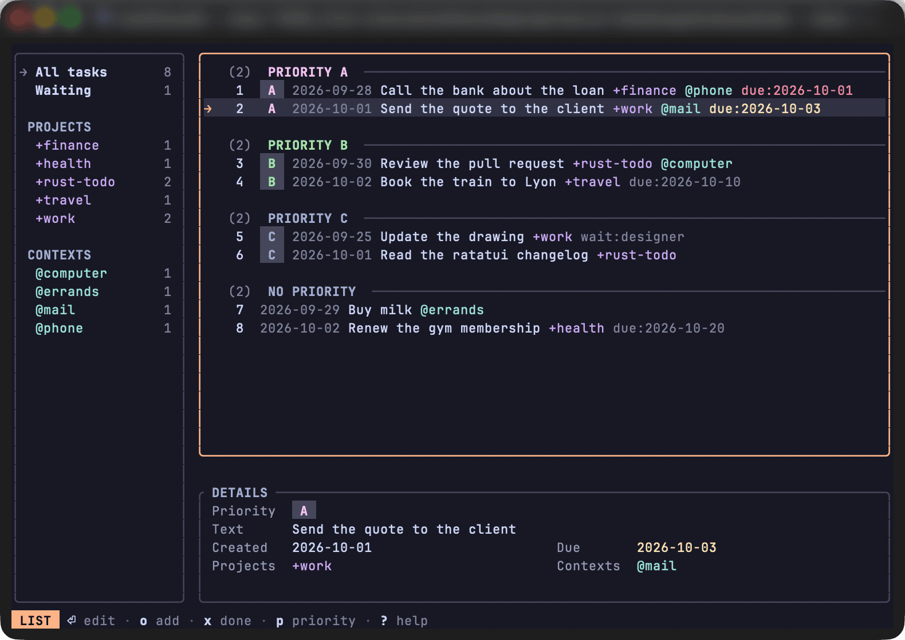

# todo

A small editor for a [todo.txt](https://github.com/todotxt/todo.txt) file: a command line to add, list and complete tasks, and a full-screen list meant for a [herdr](https://herdr.dev) popup.



## Install

It needs Rust 1.88 or later, and a terminal showing 24-bit colour: the colours are Catppuccin Mocha's, set as RGB rather than taken from the terminal's theme.

```sh
cargo install --locked --git https://github.com/MatthieuELIE/rust-todo --tag v0.2.0
```

This puts `todo` in `~/.cargo/bin`; drop `--tag` for the latest `main`, or run `cargo install --locked --path .` in a clone.
It is developed on macOS and its tests run on Linux; it has not been tried on Windows.

## Usage

The task file is `~/todo.txt`, or the path in `$TODO_FILE` if it is set.
Tasks are numbered by their position in the file, so a filtered `list` shows gaps.

```sh
todo add "Buy milk"           # append a task, stamped with today's date
todo add "(A) Call the bank"  # with a priority
todo list                     # pending tasks
todo list --all               # including the done ones
todo list +finance -@phone    # tasks with +finance and without @phone
todo do 2                     # mark task 2 as done
todo remove 2                 # delete task 2
```

Only `add`, `do`, `remove` and the interactive list write the file, and the write is atomic.
`ls`, `a` and `rm` are aliases for `list`, `add` and `remove`, as in `todo.sh`, and `done` still works for `do`.

## Interactive list

`todo` with no command opens the list full screen, meant for a terminal popup kept open a few seconds.
Every change is written at once, and `q` quits without asking.
When the file changes on disk while the list is open, the list is reloaded and the key pressed at that moment is ignored.

In herdr, a key opens it in a popup from `~/.config/herdr/config.toml`:

```toml
[[keys.command]]
key = "prefix+t"
type = "popup"
command = "todo"
description = "todo list"
width = "80%"
height = "75%"
```

`?` shows every key.

## Documentation

The keys of the list, the popup, how `list` filters and colours, and the line format are described in [the documentation](https://matthieuelie.github.io/rust-todo/).

## License

MIT, see [LICENSE](LICENSE).
