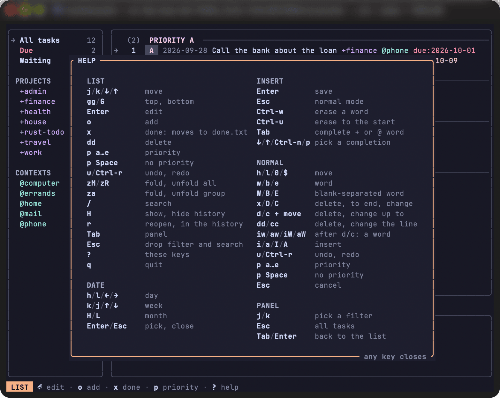
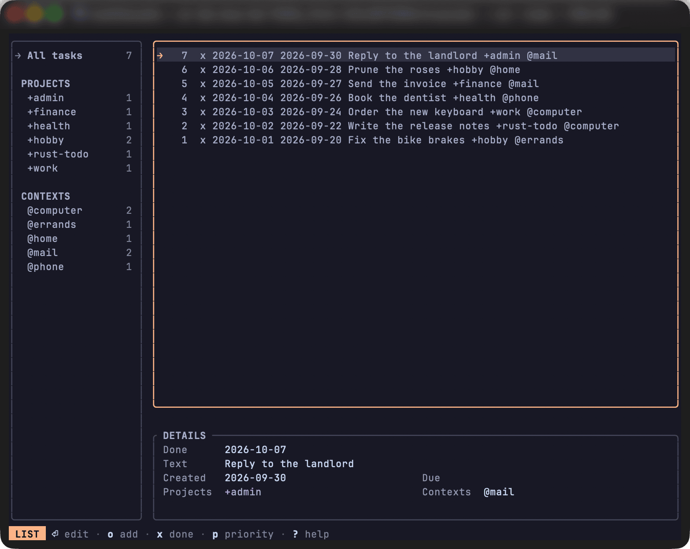
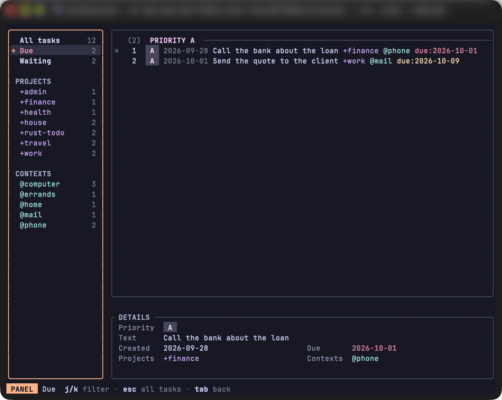

# Interactive list

`todo` with no command opens the list full screen.
Adding and editing a task happen in [the popup](popup.md).

## Keys

| Key | Action |
| --- | --- |
| `j` `k`, `↓` `↑` | move |
| `gg`, `G` | top, bottom |
| `Enter` | edit the task in the popup |
| `o` | add a task in the popup, typed as for `todo add` |
| `x` | complete: the task moves to `done.txt` |
| `dd` | delete |
| `p` then `a` to `e` | set the priority; `p` then `Space` clears it |
| `u`, `Ctrl-R` | undo, redo |
| `zM`, `zR` | fold, unfold every priority group |
| `za` | fold or unfold the group under the cursor |
| `/` | search, filtering at each letter |
| `H` | show the history, the tasks of `done.txt`, or go back to the list |
| `r` | in the history, reopen the task: it moves back to the task file |
| `Tab` | move to the filter panel |
| `Esc` | drop the filter and the search |
| `?` | show the keys |
| `q`, `Ctrl-C` | quit |

`gg`, `dd`, `p`, `zM`, `zR` and `za` wait for their second key without a timer, and any other key drops them and acts.
After `p`, in the list and the popup alike, any key but `a` to `e` and `Space` is ignored and the status bar says `priority is a to e, or space`.
`x` stamps the task with today's date, adds it to the end of `done.txt` and takes it off the list, as `todo do` does; `u` is the way back.
A done task still in the task file, one typed by hand, is not listed: `todo archive` moves it to `done.txt`.
`?` shows every key, grouped by mode, and any key closes it.
A key pressed with `Ctrl` or `Alt` does nothing in the list, the filter panel, the popup's normal mode and its calendar unless it is listed: `Ctrl-D` is not `d`, and it drops a command waiting for its second key.

## Screen

The rows are those of `todo list`: same numbers, order and colours.
An empty list says `nothing to do`, or `no matching task` under a filter or a search.
The screen is painted in Catppuccin Mocha's mantle (`#181825`), the background herdr gives its popups with its `catppuccin` theme, rather than left to the terminal's; outside herdr it stays that colour.
Text is in Mocha's `text` colour, and greyer the less it needs reading: labels, section names and the history, then dates, counts and `key:value` words.
The panel, the list and the details sit each in its own rounded card, a column or a row apart, the card that gets the keys bordered in peach; the popups float over them on a lighter background.
The row under the cursor is marked `→`, peach on a lighter background where the keys go, the list or the panel after `Tab`, and grey without background in the other.
The status bar shows the mode in a peach block, the active filters coloured as in the list, then the mode's main keys, bold before their greyed action, when they fit and no message is shown; a message goes on the right, red when something was refused.
While a command waits for its end, in the list or the popup, the keys typed so far, such as `d` or `ci`, show on the right in place of a message.

## Undo

`u` steps back through the changes made since the list was opened, and `Ctrl-R` steps forward again.
Each step restores the whole list, so undoing `x` brings the task back at its place with the priority dropped when it was done.
Undoing `x` also reads `done.txt` again and takes out its last line equal to the task; when the line is no longer there the task comes back all the same and the status bar says so. `Ctrl-R` sends it to `done.txt` again.
`done.txt` is not watched: a change made to it elsewhere shows at the next read.
These steps are not saved: they are lost when the list closes or the file is reloaded.

## History

`H` swaps the content of the list for `done.txt`, the file next to the task file that `x` and `todo do` fill, and `H` again brings the task file back.
The tasks are numbered by their position in `done.txt`, as `todo list --done` numbers them, and listed from the last line up, so the task completed last comes first; there are no groups.
Their lines are in light grey, not struck through, and the names of the filter panel turn the same grey: that is the only sign that the history is on screen. The details keep their colours.
The panel lists the `+projects` and `@contexts` of the history, without `Due` and `Waiting`, `/` searches it, and the filter and the search in use are kept when `H` is pressed, either way. Under `Due` the history shows no done task, a done task being never due, and under `Waiting` it shows its tasks holding a `wait:`, though the panel marks no entry: `Esc` drops the filter.
The history is read-only but for one key: `x`, `dd`, `o`, `Enter`, `p`, `u` and `Ctrl-R` are refused there with `history is read-only`.
`r` reopens the task under the cursor, as `todo reopen` does with its number: the task goes to the end of the task file, pending and without its completion date, its line leaves `done.txt`, whose other lines are left as written, and the status bar says `reopened`. A line that is not a done task, or that `todo reopen` would refuse, is refused in the same words. Outside the history `r` does nothing.
A reopen is undone from the list, not from the history: after `H`, `u` takes the task off the task file and adds its line to the end of `done.txt`, not where it was, and `Ctrl-R` reopens it again.
`done.txt` is read when the list opens, at each `H`, when the task file is reloaded and after the list itself moves a task to or from it; it is not watched, so a change made to it alone elsewhere shows at the next `H`.
A line of `done.txt` without its `x` is shown as written. With no `done.txt`, or an empty one, the list says `nothing done`.

## Priority groups

When a task on screen has a priority, the list is grouped under `PRIORITY A` to `PRIORITY E`, `NO PRIORITY`, each header with how many tasks it holds and a blank row before each group but the first.
`zM` folds every group into its header, `zR` unfolds them all, and `za` folds or unfolds one; the cursor can stand on a folded header, where `x`, `dd`, `p` and `Enter` do nothing.
Folds are not remembered: the list opens unfolded, and a group that leaves the screen comes back unfolded.

## Details

Under the list, a `DETAILS` card shows the task under the cursor, its line being cut at the screen's edge: its priority, its text without the tags and `key:value` ending it, its creation date and `due:` value, coloured as in the list, its projects and contexts, and its other `key:value` words.
A task of the history shows its completion date in place of the priority, and its `due:` date is not coloured.
A value too long for its place ends with `…`.
The zone stays empty when the cursor is on a folded group, and it is hidden when the list would be left with fewer than 5 rows.

## Filter panel

The panel on the left lists `All tasks`, `Due` when a task is due, `Waiting` when a task shown waits, then every `+project` and `@context` of the tasks shown under `PROJECTS` and `CONTEXTS` headers, with how many tasks each shows.
Moving through it with `j` and `k` filters the list, `Esc` goes back to `All tasks`, and `Tab` or `Enter` returns to the list.
A panel entry shows the tasks with that exact word, case included: `+rust` leaves out `+rust-todo`, and `+Books` and `+books` are two entries.
`Due` shows the pending tasks whose `due:` date is today or past, as `todo list --due` does; its name is red when one of them is overdue and yellow when they are all for today, and it keeps that colour while selected. A task added under `Due` gets `due:` with today's date, unless its line holds a `due:` with a value already.
`Waiting` shows the tasks holding a `wait:` key:value, such as `Update the drawing wait:designer`; `/wait:figma` narrows it to one.

## Search

`/` opens the search line in the status bar, and the list filters at each letter.
The search is terms as for `todo list`, and it applies on top of a panel filter.
`Enter` keeps it and goes back to the list, and `Esc` clears it.
