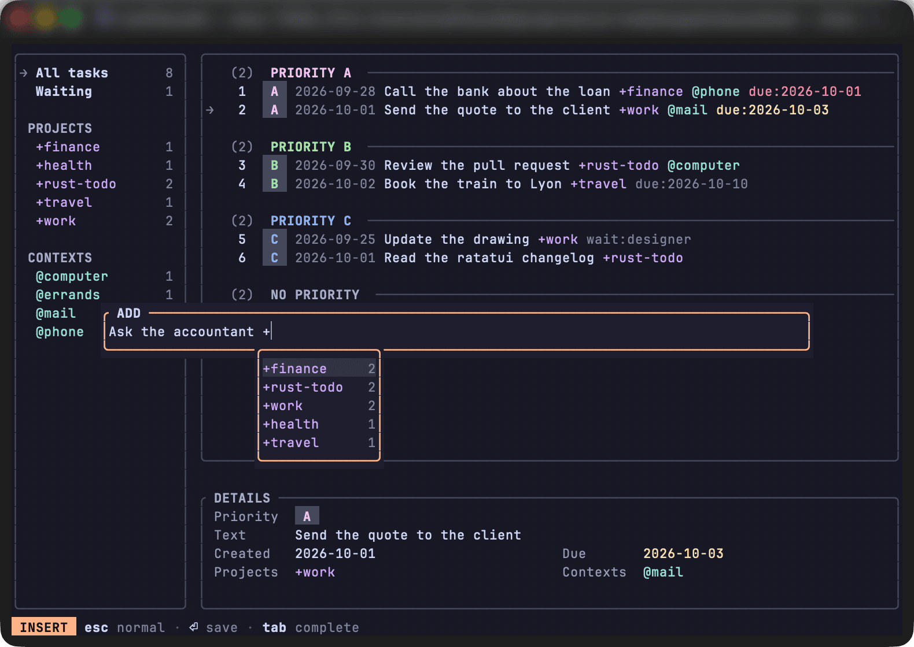

# The popup

`o` and `Enter` open a centred popup holding one todo.txt line, which wraps when long.
`o` opens it empty in insert mode; `Enter` opens it on the task's line in normal mode, with the cursor at the start.
The line is coloured as you type, as in the list, and the terminal's cursor is a bar in insert mode and a block in normal mode, as in Neovim.

## Keys

| Mode | Key | Action |
| --- | --- | --- |
| insert | characters, `←` `→`, `Home` `End` | type, move |
| insert | `Backspace`, `Delete` | erase before, under the cursor |
| insert | `Ctrl-W`, `Ctrl-U` | erase the word before the cursor, back to the start |
| insert | `↓` `↑`, `Ctrl-N` `Ctrl-P` | pick a completion |
| insert | `Tab` | write the picked completion |
| insert | `Esc` | normal mode |
| normal | `h` `l` `0` `$` | move |
| normal | `w` `b` `e`, `W` `B` `E` | move by word, by blank-separated word |
| normal | `x`, `D`, `C` | delete a character, to the end, change to the end |
| normal | `d` or `c`, then a motion | delete, change up to where it goes |
| normal | `d` or `c`, then `iw` `aw` `iW` `aW` | delete, change the word under the cursor, with its space for `a` |
| normal | `dd`, `cc` | delete, change the whole line |
| normal | `i` `a` `I` `A` | insert mode |
| normal | `u`, `Ctrl-R` | undo, redo |
| normal | `p` then `a` to `e` | set the priority; `p` then `Space` clears it |
| normal | `Esc` | cancel |
| both | `Enter` | save |
| calendar | `h` `l`, `k` `j`, `H` `L` | move by a day, a week, a month |
| calendar | `Enter`, `Esc` | write the date, close |

## Editing

In insert mode, characters go in at the cursor, and `←` `→`, `Home` `End`, `Backspace` `Delete`, `Ctrl-W` (the word before the cursor) and `Ctrl-U` (back to the start) edit the line.
Normal mode is a small subset of vim: `h` `l` `0` `$`, `w` `b` `e` and `W` `B` `E`, `x`, `D`, `C`, `i` `a` `I` `A`.
`d` and `c` take any of these motions, as in `db`, `ce` or `d$`, `c` then going to insert mode; `dd` empties the line and `cc` empties it to type it again.
`d` and `c` also take the word under the cursor, wherever the cursor is in it: `iw` is the run of letters or of punctuation, `iW` the whole blank-separated word, so `ciW` on `due:2026-10-15` replaces the tag; `aw` and `aW` take its space too, the one after it or, on the last word, the one before.
After `d` or `c`, a key that completes no command cancels it and does nothing: `Esc` then leaves the popup open, and `Enter` does not save.
`u` and `Ctrl-R` undo and redo the changes made in the popup, what was typed between entering insert mode and `Esc` being one change; this history is the popup's own and is lost when it closes.
`p` then `a` to `e` writes or replaces the priority at the start of the line, and `p` then `Space` drops it, as in the list; a done line is left alone.
`Esc` goes from insert to normal mode and cancels from normal mode, so dropping a task being added takes `Esc Esc`; `Enter` saves from either mode.
A paste goes in at the cursor as one line, its line breaks and other control characters turned into spaces; outside the popup and the search it is ignored.

## Completion

While a word starting with `+`, `@` or `wait:` is typed, a drop-down lists the projects, contexts or `wait:` values of the whole file, done tasks included, that start like it whatever the case, the most used first.
`↓` `↑` or `Ctrl-N` `Ctrl-P` pick one, and `Tab` writes it in place of the word, followed by a space; `Esc` and `Enter` keep their meaning.

## Date picker

When a key leaves `due:` alone before the cursor, typed or with its value erased, a calendar of the month drops down under it, weeks from Monday, on today: the picked date peach, today yellow, past days greyed.
`h` `l` move by a day, `k` `j` by a week, `H` `L` by a month, the arrows as their letters; `Enter` writes the date after `due:`, followed by a space, and `Esc` closes it, leaving `due:` to be typed by hand.
Any other key and a paste are ignored while it is open.

## Saving

An added task is stamped with today's date, and under a panel filter it gets the filter's term appended when it lacks that exact word; under `Due` it gets `due:` with today's date unless its line holds a `due:` date or value, the popup being titled `ADD (Due)`; under `Waiting` it gets nothing and the panel goes back to `All tasks`.
An edited line replaces the task as typed, marker, priority and dates included; only an empty description is refused.
A pending task whose `x` marker is typed is completed on the day, as with `x` in the list.
When the file changes on disk during an edit, the edit is cancelled, since the task's number may now name another task; an add stays open.
